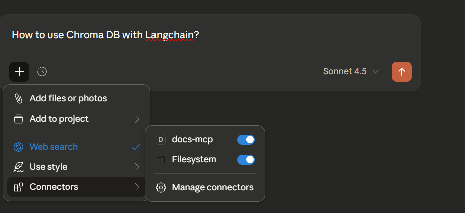
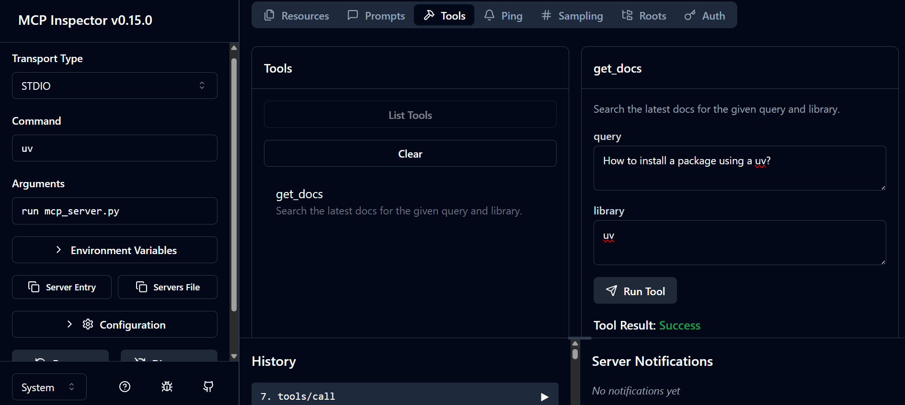

# 📚 MCP Docs Server - AI-Powered Documentation Search

> A Model Context Protocol (MCP) server that intelligently searches and retrieves documentation from popular Python libraries using AI.

[](https://www.python.org/downloads/)
[](https://github.com/jlowin/fastmcp)
[](https://opensource.org/licenses/MIT)

## 🌟 Features

- 🔍 **Smart Documentation Search** - Query documentation from LangChain, LlamaIndex, OpenAI, and UV
- 🤖 **AI-Powered Responses** - Uses Groq LLM to provide human-readable answers from documentation
- ⚡ **Fast & Async** - Built with async/await for optimal performance
- 🛠️ **MCP Protocol** - Standard Model Context Protocol implementation
- 🌐 **Web Scraping** - Intelligent HTML to text conversion using Trafilatura
- 🔗 **Multiple APIs** - Integrates Serper API for search and Groq for LLM responses

## 📸 Screenshots

<!-- Add your screenshots here -->



## 🚀 Quick Start

### Prerequisites

- Python 3.12 or higher
- [UV package manager](https://docs.astral.sh/uv/) (recommended)
- API Keys:
  - [Serper API](https://serper.dev/) for web search
  - [Groq API](https://groq.com/) for LLM responses

### Installation

1. **Clone the repository**
   ```bash
   git clone https://github.com/Aadityayadav333/Building-Local-MCP-Server
   cd mcp-docs-server
   ```

2. **Set up environment**
   ```bash
   # Using UV (recommended)
   uv venv
   source .venv/bin/activate  # On Windows: .venv\Scripts\activate
   uv pip install -e .

   # Or using pip
   pip install -r requirements.txt
   ```

3. **Configure environment variables**
   
   Create a `.env` file in the project root:
   ```env
   SERPER_API_KEY=your_serper_api_key_here
   GROQ_API_KEY=your_groq_api_key_here
   ```

### Usage

#### Running the MCP Server

```bash
uv run mcp_server.py
```

#### Running the Client (Demo)

```bash
python client.py
```

The client demonstrates how to:
- Connect to the MCP server
- Search documentation
- Get AI-generated responses

#### Example Code

```python
import asyncio
from mcp.client.session import ClientSession
from mcp.client.stdio import stdio_client

async def query_docs():
    async with stdio_client(server_params) as (read_stream, write_stream):
        async with ClientSession(read_stream, write_stream) as session:
            await session.initialize()
            
            # Search LangChain docs for ChromaDB integration
            result = await session.call_tool(
                "get_docs",
                arguments={
                    "query": "chromadb integration",
                    "library": "langchain"
                }
            )
            print(result.content)
```

## 🛠️ Architecture

### Components

1. **MCP Server** (`mcp_server.py`)
   - Implements the FastMCP server
   - Provides `get_docs` tool for documentation search
   - Handles web search via Serper API
   - Fetches and cleans HTML content

2. **Client** (`client.py`)
   - Demonstrates MCP client usage
   - Integrates with Groq LLM for response generation
   - Shows tool calling patterns

3. **Utilities** (`utils.py`)
   - HTML to text conversion using Trafilatura
   - LLM response generation helper
   - API integrations

### Supported Documentation Sources

| Library | Documentation URL |
|---------|------------------|
| LangChain | https://python.langchain.com/docs |
| LlamaIndex | https://docs.llamaindex.ai/en/stable |
| OpenAI | https://platform.openai.com/docs |
| UV | https://docs.astral.sh/uv |

## 📖 API Reference

### `get_docs(query: str, library: str)`

Searches documentation for the specified library.

**Parameters:**
- `query` (str): Search query
- `library` (str): Library name (`langchain`, `llama-index`, `openai`, `uv`)

**Returns:**
- Documentation content with source URLs

**Example:**
```python
result = await session.call_tool(
    "get_docs",
    arguments={
        "query": "vector store setup",
        "library": "langchain"
    }
)
```

## 🔧 Configuration

### Environment Variables

| Variable | Description | Required |
|----------|-------------|----------|
| `SERPER_API_KEY` | API key for Serper search service | Yes |
| `GROQ_API_KEY` | API key for Groq LLM | Yes |

### Customization

To add more documentation sources, edit `docs_urls` in `mcp_server.py`:

```python
docs_urls = {
    "your-library": "https://docs.your-library.com",
}
```

## 📦 Dependencies

- `fastmcp>=2.14.1` - MCP server framework
- `httpx>=0.28.1` - Async HTTP client
- `trafilatura>=2.0.0` - HTML to text extraction
- `groq>=0.37.1` - Groq API client
- `python-dotenv>=1.2.1` - Environment variable management

## 🤝 Contributing

Contributions are welcome! Please feel free to submit a Pull Request.

1. Fork the repository
2. Create your feature branch (`git checkout -b feature/AmazingFeature`)
3. Commit your changes (`git commit -m 'Add some AmazingFeature'`)
4. Push to the branch (`git push origin feature/AmazingFeature`)
5. Open a Pull Request

## 📝 License

This project is licensed under the MIT License - see the [LICENSE](LICENSE) file for details.

## 🙏 Acknowledgments

- [FastMCP](https://github.com/jlowin/fastmcp) - Excellent MCP server framework
- [Serper](https://serper.dev/) - Powerful search API
- [Groq](https://groq.com/) - Fast LLM inference
- [Trafilatura](https://trafilatura.readthedocs.io/) - Clean web content extraction

## 📬 Contact


Project Link: (https://github.com/Aadityayadav333/Building-Local-MCP-Server)

---

## 🙏 Credits 

This project was inspired by and uses code from:

- **[Hassan's MCP Tutorial]** - [](https://github.com/AIwithhassan) - Base MCP server implementation
- Original tutorial: [https://youtu.be/U0boR8cqYqQ?si=E-VFgq1_U-eE8rEF]

Special thanks to Hassan for the excellent MCP server tutorial that served as the foundation for this project.

**⭐ If you find this project useful, please consider giving it a star!**
